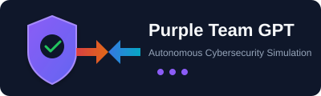
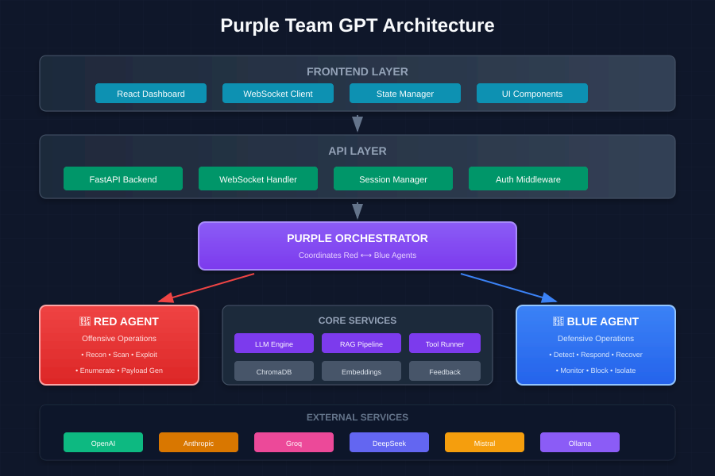
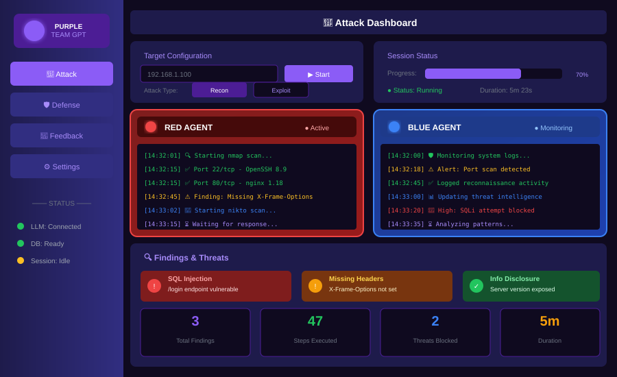
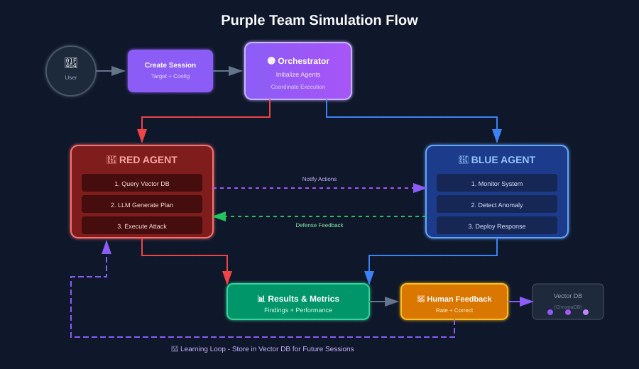
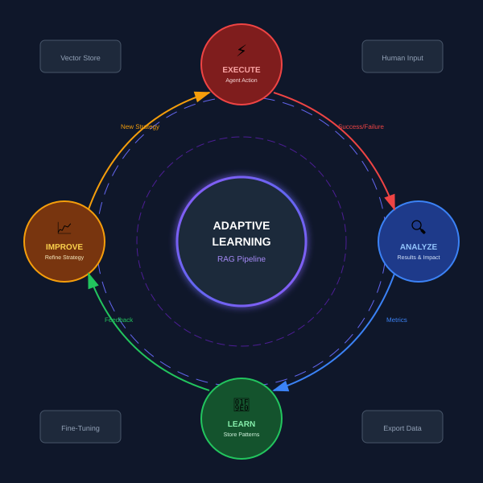
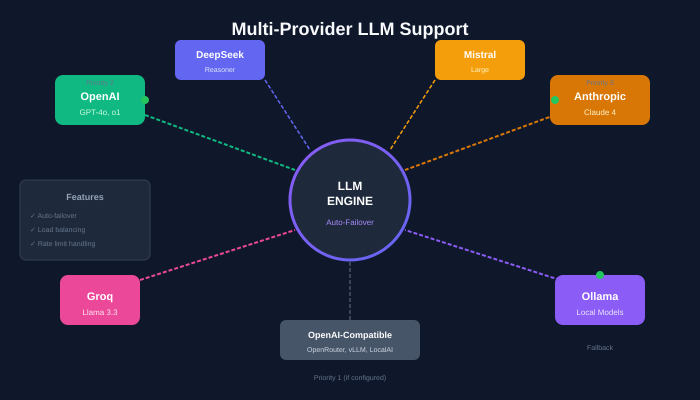
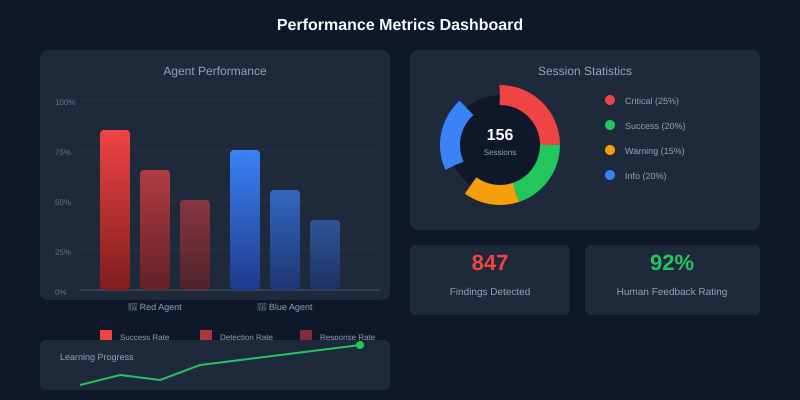

<div align="center">



### *Autonomous Cybersecurity Simulation Framework*

**AI-Powered Red Team vs Blue Team with Adaptive Learning**

[](https://python.org)
[](https://fastapi.tiangolo.com)
[](https://reactjs.org)
[](LICENSE)
[](tests/)

[🚀 Quick Start](#-quick-start) • [📖 Documentation](#-documentation) • [🔧 Configuration](#-configuration) • [🤝 Contributing](#-contributing)

</div>

---

## 📋 Table of Contents

- [Overview](#-overview)
- [Key Features](#-key-features)
- [Architecture](#-architecture)
- [Screenshots](#-screenshots)
- [Flow Diagrams](#-flow-diagrams)
- [Quick Start](#-quick-start)
- [Installation](#-installation)
- [Configuration](#-configuration)
- [Usage](#-usage)
- [API Reference](#-api-reference)
- [Tool Arsenal](#-tool-arsenal)
- [Development](#-development)
- [Security](#-security)
- [Contributing](#-contributing)
- [License](#-license)

---

## 🎯 Overview

Purple Team GPT is a cutting-edge **autonomous cybersecurity simulation framework** that implements a continuous "Cat and Mouse" game between AI-powered offensive (Red) and defensive (Blue) agents. Unlike traditional security scanners, our multi-agent architecture enables:

| Feature | Description |
|---------|-------------|
| 🤖 **Autonomous Agents** | Red and Blue agents operate independently with LLM-driven decision making |
| 🔄 **Simultaneous Execution** | Both agents run in parallel, responding to each other in real-time |
| 🧠 **Adaptive Learning** | RAG pipeline with ChromaDB stores successful tactics for future reference |
| 👤 **Human-in-the-Loop** | Rate and correct agent decisions to improve future performance |
| 🔀 **Multi-LLM Support** | OpenAI, Anthropic, Groq, DeepSeek, Mistral, Ollama, and OpenAI-compatible APIs |
| 📊 **Fine-Tuning Export** | Export high-quality interactions for custom model training |

---

## ✨ Key Features

### 🔴 Red Agent (Offensive)
- **Network Reconnaissance**: Automated target discovery and enumeration
- **Vulnerability Scanning**: Web app and network vulnerability detection
- **Exploitation**: Safe-mode exploitation with rollback capabilities
- **Payload Generation**: LLM-generated payloads based on target profile

### 🔵 Blue Agent (Defensive)
- **Real-time Detection**: Log analysis and anomaly detection
- **Automated Response**: Firewall rules, process termination, service isolation
- **Threat Intelligence**: Correlation of red team tactics with defense strategies
- **Recovery Operations**: Automated service restoration and cleanup

### 🟣 Purple Orchestrator
- **Agent Coordination**: Manages Red ↔ Blue communication
- **Session Management**: Isolated simulation environments
- **Metrics Collection**: Performance tracking for both agents
- **Feedback Integration**: Incorporates human feedback into decision-making

---

## 🏗️ Architecture



The system is built on a **Feedback-Driven Loop** where the success of one agent becomes the training data for the other:

| Layer | Components | Purpose |
|-------|------------|---------|
| **Frontend** | React Dashboard, WebSocket Client | Real-time monitoring & control |
| **API** | FastAPI, Session Manager, Auth | REST & WebSocket endpoints |
| **Orchestration** | Purple Orchestrator | Agent coordination |
| **Agents** | Red Agent, Blue Agent | Offensive & Defensive operations |
| **Core** | LLM Engine, RAG Pipeline, Tool Runner | Intelligence & execution |
| **Data** | ChromaDB, Feedback Store | Persistent learning |

---

## 📸 Screenshots

### Attack Dashboard



The dashboard provides a unified view of both agents:

| Panel | Description |
|-------|-------------|
| 🎯 **Target Config** | Configure target IP, attack type, and execution parameters |
| 📊 **Status Panel** | Real-time progress, duration, and session status |
| 🔴 **Red Agent Log** | Live feed of offensive operations |
| 🔵 **Blue Agent Log** | Live feed of defensive operations |
| 🔍 **Findings Panel** | Discovered vulnerabilities and blocked threats |

---

## 📊 Flow Diagrams

### Simulation Flow



The simulation follows a structured flow:

1. **User** creates session with target configuration
2. **Orchestrator** initializes both agents
3. **Red Agent** queries Vector DB, plans attack, executes
4. **Blue Agent** monitors, detects, responds
5. **Cross-communication** between agents in real-time
6. **Results** collected and displayed
7. **Human Feedback** submitted and stored for learning

### Learning Cycle



The adaptive learning system continuously improves:

```
Execute → Analyze → Learn → Improve → Execute (loop)
```

| Phase | Action |
|-------|--------|
| ⚡ **Execute** | Agent performs action |
| 🔍 **Analyze** | Results evaluated for success/failure |
| 🧠 **Learn** | Patterns stored in Vector DB |
| 📈 **Improve** | Strategy refined based on feedback |

---

## 🚀 Quick Start

### Prerequisites

| Requirement | Version | Purpose |
|-------------|---------|---------|
| Python | 3.11+ | Backend runtime |
| Node.js | 18+ | Frontend build |
| Docker | 24+ | Containerized execution |
| Docker Compose | 2.20+ | Multi-container orchestration |

### One-Command Setup

```bash
# Clone and start
git clone https://github.com/your-org/purple-team-gpt.git
cd purple-team-gpt
cp .env.example .env
# Edit .env with your API keys
docker-compose up -d

# Access the application
open http://localhost:3000
```

---

## 📦 Installation

### Option 1: Docker (Recommended)

```bash
# 1. Clone the repository
git clone https://github.com/your-org/purple-team-gpt.git
cd purple-team-gpt

# 2. Configure environment
cp .env.example .env
nano .env  # Add your API keys

# 3. Build and start
docker-compose up -d --build

# 4. Verify services
docker-compose ps
curl http://localhost:8000/health
```

### Option 2: Manual Installation

```bash
# Backend Setup
python -m venv .venv
source .venv/bin/activate  # Linux/macOS
# or: .venv\Scripts\activate  # Windows

pip install -e ".[dev]"

# Frontend Setup
cd src/frontend
npm install
npm run build

# Run
uvicorn purple_team_gpt.backend.main:app --reload --host 0.0.0.0 --port 8000
```

### Option 3: Development Mode

```bash
# Terminal 1: Backend
source .venv/bin/activate
uvicorn purple_team_gpt.backend.main:app --reload

# Terminal 2: Frontend
cd src/frontend
npm run dev

# Terminal 3: Ollama (optional, for local LLM)
ollama serve
ollama pull llama3.2
```

---

## ⚙️ Configuration

### LLM Providers



### Environment Variables

Create a `.env` file in the project root:

```env
# =============================================================================
# LLM PROVIDERS (Configure at least one)
# =============================================================================

# OpenAI (Recommended)
OPENAI_API_KEY=sk-proj-xxxxxxxxxxxx

# Anthropic Claude (Alternative)
ANTHROPIC_API_KEY=sk-ant-xxxxxxxxxxxx

# Groq (Fast inference)
GROQ_API_KEY=gsk_xxxxxxxxxxxx

# DeepSeek (Cost-effective)
DEEPSEEK_API_KEY=sk-xxxxxxxxxxxx

# Mistral AI
MISTRAL_API_KEY=xxxxxxxxxxxx

# =============================================================================
# LOCAL LLM (Ollama)
# =============================================================================
OLLAMA_BASE_URL=http://localhost:11434
OLLAMA_DEFAULT_MODEL=llama3.2

# =============================================================================
# OPENAI-COMPATIBLE ENDPOINTS
# =============================================================================
# OpenRouter
OPENAI_COMPATIBLE_BASE_URL=https://openrouter.ai/api/v1
OPENAI_COMPATIBLE_API_KEY=sk-or-xxxxxxxxxxxx
OPENAI_COMPATIBLE_MODEL=anthropic/claude-3.5-sonnet

# =============================================================================
# DEFAULT SETTINGS
# =============================================================================
DEFAULT_LLM_PROVIDER=openai
DEFAULT_MODEL=gpt-4o
LLM_TEMPERATURE=0.7
LLM_MAX_TOKENS=4096
ENABLE_FAILOVER=true

# =============================================================================
# DATABASE
# =============================================================================
CHROMA_PERSIST_DIR=./data/chromadb
FEEDBACK_DB_PATH=./data/feedback.db

# =============================================================================
# SECURITY
# =============================================================================
SAFE_MODE=true
MAX_STEPS=50
AUDIT_LOG_PATH=./logs/audit.log
```

### Failover Priority

The system automatically fails over in this order:

```
1. OpenAI-Compatible Endpoints (if configured)
   ↓
2. OpenAI (if API key set)
   ↓
3. Anthropic (if API key set)
   ↓
4. Groq (if API key set)
   ↓
5. DeepSeek (if API key set)
   ↓
6. Mistral (if API key set)
   ↓
7. Ollama (always available as fallback)
```

---

## 💻 Usage

### Web Dashboard

Access the web interface at `http://localhost:3000`:

| Dashboard | Description |
|-----------|-------------|
| 🎯 **Attack** | Configure targets, select attack types, monitor live execution |
| 🛡️ **Defense** | View detected threats, deploy countermeasures, monitor system health |
| 📝 **Feedback** | Rate agent performance, provide corrections, export interactions |

### CLI Usage

```bash
# Start a simulation
purple-team attack --target 192.168.1.100 --type recon

# Start defensive monitoring
purple-team defend --config config/blue_agent.yaml

# Run full purple team exercise
purple-team exercise --target 192.168.1.100 --duration 60m

# Export feedback for fine-tuning
purple-team export --rating 4+ --format jsonl --output training_data.jsonl
```

### Programmatic Usage

```python
from purple_team_gpt import PurpleOrchestrator, LLMEngine, VectorStore
from purple_team_gpt.config import get_settings

# Initialize
settings = get_settings()
engine = LLMEngine(settings.llm)
vector_store = VectorStore(settings.chroma_persist_dir)
orchestrator = PurpleOrchestrator(engine, vector_store)

# Create session
session = orchestrator.create_session(
    target="192.168.1.100",
    attack_type="reconnaissance"
)

# Start simulation
await orchestrator.start_session(session.id)

# Submit feedback
await orchestrator.submit_feedback(
    session_id=session.id,
    agent="red",
    step_id="step_001",
    rating=5,
    comment="Excellent reconnaissance strategy"
)
```

---

## 🔌 API Reference

### REST Endpoints

#### Sessions

| Method | Endpoint | Description |
|--------|----------|-------------|
| `POST` | `/api/v1/sessions/` | Create new simulation session |
| `GET` | `/api/v1/sessions/` | List all sessions |
| `GET` | `/api/v1/sessions/{id}` | Get session details |
| `POST` | `/api/v1/sessions/{id}/start` | Start simulation |
| `POST` | `/api/v1/sessions/{id}/stop` | Stop simulation |
| `GET` | `/api/v1/sessions/{id}/metrics` | Get performance metrics |

#### Feedback

| Method | Endpoint | Description |
|--------|----------|-------------|
| `POST` | `/api/v1/feedback/` | Submit agent feedback |
| `GET` | `/api/v1/feedback/` | List all feedback |
| `POST` | `/api/v1/feedback/export` | Export for fine-tuning |

### WebSocket Events

Connect to `/ws/session/{session_id}` for real-time updates:

```javascript
const ws = new WebSocket('ws://localhost:8000/ws/session/abc123');

ws.onmessage = (event) => {
  const data = JSON.parse(event.data);
  console.log(`Event: ${data.type}`, data);
};
```

**Event Types:**

| Event | Description | Payload |
|-------|-------------|---------|
| `step` | Agent executed action | `{agent, action, result}` |
| `finding` | Vulnerability detected | `{title, severity, evidence}` |
| `status` | Session status change | `{status, progress}` |
| `complete` | Simulation finished | `{metrics, summary}` |

---

## 🧰 Tool Arsenal

### Red Arsenal (Offensive)

| Tool | Description | Risk | Safe Mode |
|------|-------------|------|-----------|
| `nmap` | Network/port scanning | 🟢 Low | ✅ Enabled |
| `nikto` | Web vulnerability scanning | 🟢 Low | ✅ Enabled |
| `gobuster` | Directory enumeration | 🟡 Medium | ✅ Enabled |
| `sqlmap` | SQL injection testing | 🔴 High | ⚠️ Limited |
| `hydra` | Credential brute forcing | 🔴 High | ❌ Disabled |

### Blue Arsenal (Defensive)

| Tool | Description | Risk | Auto-Deploy |
|------|-------------|------|-------------|
| `log_monitor` | Real-time log analysis | 🟢 Low | ✅ Yes |
| `process_watcher` | Process monitoring | 🟢 Low | ✅ Yes |
| `file_integrity` | FIM for critical files | 🟢 Low | ✅ Yes |
| `firewall_manager` | iptables/ufw management | 🟡 Medium | ⚠️ Manual |
| `quarantine` | Host quarantine | 🔴 High | ❌ Manual |

---

## 📈 Performance Metrics



---

## 🔧 Development

### Project Structure

```
purple-team-gpt/
├── 📁 src/purple_team_gpt/
│   ├── 📁 agents/                 # Agent implementations
│   │   ├── base.py               # Base agent class
│   │   ├── red_agent.py          # Offensive agent
│   │   └── blue_agent.py         # Defensive agent
│   ├── 📁 backend/               # FastAPI application
│   │   ├── main.py              # App entry point
│   │   └── routers/             # API routes
│   ├── 📁 core/                  # Core services
│   │   ├── orchestrator.py      # Purple orchestrator
│   │   ├── 📁 llm/              # LLM engine
│   │   └── 📁 rag/              # RAG pipeline
│   └── 📁 tools/                 # Tool execution
├── 📁 scripts/
│   ├── 📁 red_arsenal/           # Offensive tools
│   └── 📁 blue_arsenal/          # Defensive tools
├── 📁 src/frontend/              # React web UI
├── 📁 tests/                     # Test suite (146 passing)
├── 📁 docs/assets/              # Documentation images
└── 📄 README.md
```

### Running Tests

```bash
# Run all tests
pytest tests/ -v

# With coverage
pytest tests/ --cov=src/purple_team_gpt --cov-report=html

# Specific test file
pytest tests/test_llm_engine.py -v
```

---

## 🔒 Security

### Safety Features

| Feature | Description | Default |
|---------|-------------|---------|
| **Safe Mode** | Prevents destructive operations | ✅ Enabled |
| **Tool Sandboxing** | Tools run in Docker containers | ✅ Enabled |
| **Audit Logging** | All actions logged | ✅ Enabled |
| **Rate Limiting** | Prevents runaway execution | ✅ 100 req/min |
| **Authorization Checks** | Verifies target ownership | ✅ Enabled |

### Best Practices

1. ✅ **Only test targets you own** or have explicit written authorization
2. ✅ **Use Safe Mode** for initial reconnaissance
3. ✅ **Review agent actions** before high-risk operations
4. ✅ **Keep API keys secure** - never commit to version control
5. ✅ **Monitor resource usage** - simulations can be intensive

---

## 🤝 Contributing

We welcome contributions! Please follow these steps:

```bash
# 1. Fork and clone
git clone https://github.com/YOUR_USERNAME/purple-team-gpt.git

# 2. Create feature branch
git checkout -b feature/amazing-feature

# 3. Make changes and test
pytest tests/ -v

# 4. Commit with conventional commits
git commit -m "feat: add amazing feature"

# 5. Push and create PR
git push origin feature/amazing-feature
```

### Commit Conventions

| Type | Description | Example |
|------|-------------|---------|
| `feat` | New feature | `feat: add XSS scanner` |
| `fix` | Bug fix | `fix: handle API timeout` |
| `docs` | Documentation | `docs: update README` |
| `test` | Add tests | `test: add orchestrator tests` |

---

## 📄 License

```
MIT License

Copyright (c) 2024 Purple Team GPT Contributors

Permission is hereby granted, free of charge, to any person obtaining a copy
of this software and associated documentation files (the "Software"), to deal
in the Software without restriction, including without limitation the rights
to use, copy, modify, merge, publish, distribute, sublicense, and/or sell
copies of the Software, and to permit persons to whom the Software is
furnished to do so, subject to the following conditions:

The above copyright notice and this permission notice shall be included in all
copies or substantial portions of the Software.
```

---

## 📚 Documentation

| Document | Description |
|----------|-------------|
| [Architecture](docs/ARCHITECTURE.md) | Detailed system architecture |
| [Implementation Plan](docs/IMPLEMENTATION_PLAN.md) | Development roadmap |
| [API Reference](docs/API.md) | Complete API documentation |

---

## 🙏 Acknowledgments

- **[HackBot](https://github.com/yashab-cyber/hackbot)** - Inspiration for AI-powered security testing
- **[LiteLLM](https://github.com/BerriAI/litellm)** - Multi-provider LLM abstraction
- **[ChromaDB](https://www.trychroma.com/)** - Vector database for RAG pipeline
- **[FastAPI](https://fastapi.tiangolo.com/)** - Modern async Python web framework

---

## 📞 Support

| Channel | Link |
|---------|------|
| 🐛 Issues | [GitHub Issues](https://github.com/your-org/purple-team-gpt/issues) |
| 💬 Discussions | [GitHub Discussions](https://github.com/your-org/purple-team-gpt/discussions) |

---

<div align="center">

### ⚠️ Legal Disclaimer

**This tool is for authorized security testing only.**

Unauthorized use against systems you do not own or have explicit permission to test is **illegal and unethical**.

---

**[⬆ Back to Top](#-purple-team-gpt)**

Made with ❤️ by the Purple Team GPT Contributors

</div>