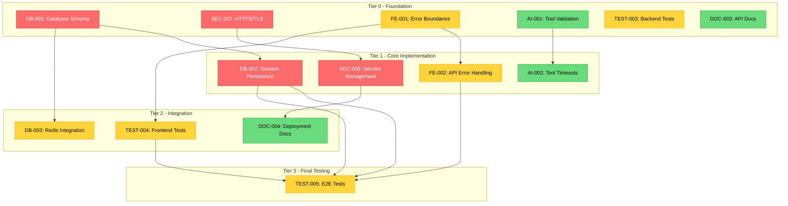

# Sprint 2 Dependency Graph
## Visual Task Dependencies

**Generated:** April 1, 2026

---

## ASCII Dependency Visualization

```
╔══════════════════════════════════════════════════════════════════════════════╗
║                          SPRINT 2 TASK DEPENDENCIES                          ║
╠══════════════════════════════════════════════════════════════════════════════╣
║                                                                              ║
║  TIER 0 - Foundation (Day 1-2)                                               ║
║  ════════════════════════════                                                ║
║                                                                              ║
║    ┌────────────┐   ┌────────────┐   ┌────────────┐   ┌────────────┐        ║
║    │   DB-001   │   │  SEC-007   │   │   FE-001   │   │   AI-001   │        ║
║    │ Database   │   │  HTTPS/    │   │   Error    │   │   Tool     │        ║
║    │  Schema    │   │    TLS     │   │ Boundaries │   │ Validation │        ║
║    │   12h      │   │   12h      │   │    8h      │   │   10h      │        ║
║    │  [dev-1]   │   │  [dev-2]   │   │  [dev-3]   │   │  [dev-4]   │        ║
║    └─────┬──────┘   └─────┬──────┘   └─────┬──────┘   └─────┬──────┘        ║
║          │                │                │                │                ║
║          ▼                ▼                ▼                ▼                ║
║  TIER 1 - Core Implementation (Day 3-5)                                      ║
║  ═════════════════════════════════════                                       ║
║                                                                              ║
║    ┌────────────┐   ┌────────────┐   ┌────────────┐   ┌────────────┐        ║
║    │   DB-002   │   │  SEC-008   │   │   FE-002   │   │   AI-002   │        ║
║    │  Session   │   │  Secrets   │   │    API     │   │   Tool     │        ║
║    │Persistence │   │Management  │   │  Errors    │   │ Timeouts   │        ║
║    │   16h      │   │   10h      │   │    6h      │   │    8h      │        ║
║    │  [dev-1]   │   │  [dev-2]   │   │  [dev-3]   │   │  [dev-4]   │        ║
║    └─────┬──────┘   └─────┬──────┘   └─────────────┘   └────────────┘        ║
║          │                │                                                 ║
║          │                ▼                                                 ║
║          │          ┌────────────┐                                          ║
║          │          │   DOC-004  │                                          ║
║          │          │Deployment  │                                          ║
║          │          │   Docs     │                                          ║
║          │          │    8h      │                                          ║
║          │          │  [dev-2]   │                                          ║
║          │          └────────────┘                                          ║
║          │                                                                  ║
║          ▼                                                                  ║
║  TIER 2 - Integration (Day 6-7)                                              ║
║  ═════════════════════════════                                               ║
║                                                                              ║
║    ┌────────────┐                      ┌────────────┐                        ║
║    │   DB-003   │                      │  TEST-004  │                        ║
║    │   Redis    │                      │  Frontend  │                        ║
║    │Integration │                      │   Tests    │                        ║
║    │   10h      │                      │    14h     │                        ║
║    │  [dev-2]   │                      │  [dev-5]   │                        ║
║    └─────┬──────┘                      └────────────┘                        ║
║          │                                                                  ║
║          ▼                                                                  ║
║  TIER 3 - Final Testing (Day 8-9)                                            ║
║  ════════════════════════════════                                            ║
║                                                                              ║
║    ┌────────────┐                                                           ║
║    │  TEST-005  │                                                           ║
║    │    E2E     │                                                           ║
║    │   Tests    │                                                           ║
║    │    12h     │                                                           ║
║    │  [dev-5]   │                                                           ║
║    └────────────┘                                                           ║
║                                                                              ║
║  INDEPENDENT - Can run anytime                                               ║
║  ════════════════════════════                                                ║
║                                                                              ║
║    ┌────────────┐   ┌────────────┐                                          ║
║    │   DOC-003  │   │  TEST-003  │                                          ║
║    │    API     │   │  Backend   │                                          ║
║    │   Docs     │   │   Tests    │                                          ║
║    │    6h      │   │    16h     │                                          ║
║    │  [dev-1]   │   │  [dev-4]   │                                          ║
║    └────────────┘   └────────────┘                                          ║
║                                                                              ║
╚══════════════════════════════════════════════════════════════════════════════╝
```

---

## Mermaid Diagram (For Documentation)



---

## Critical Path Analysis

### Longest Path (Critical Path)

```
DB-001 (12h) → DB-002 (16h) → TEST-005 (12h) = 40 hours minimum

Alternative Path:
SEC-007 (12h) → SEC-008 (10h) → DOC-004 (8h) = 30 hours
```

### Parallel Work Opportunities

| Parallel Group | Tasks | Total Hours | Combined Duration |
|----------------|-------|-------------|-------------------|
| Database Foundation | DB-001 | 12h | 12h |
| Security Foundation | SEC-007 | 12h | (parallel) |
| Frontend Foundation | FE-001 | 8h | (parallel) |
| AI Foundation | AI-001 | 10h | (parallel) |
| Backend Tests | TEST-003 | 16h | (parallel) |
| API Docs | DOC-003 | 6h | (parallel) |

### Bottleneck Analysis

**Primary Bottleneck: dev-1 (Alex Chen)**
- DB-001 (12h) + DB-002 (16h) + DOC-003 (6h) = 34h
- Sequential dependencies on DB work

**Secondary Bottleneck: dev-2 (Jordan Riley)**
- SEC-007 (12h) + SEC-008 (10h) + DB-003 (10h) + DOC-004 (8h) = 40h
- Highest total hours

---

## Task Status Board

| Task | Priority | Assignee | Est. Hours | Status | Dependencies |
|------|----------|----------|------------|--------|--------------|
| DB-001 | P0 | dev-1 | 12h | PENDING | None |
| DB-002 | P0 | dev-1 | 16h | PENDING | DB-001 |
| DB-003 | P1 | dev-2 | 10h | PENDING | DB-001 |
| SEC-007 | P0 | dev-2 | 12h | PENDING | None |
| SEC-008 | P0 | dev-2 | 10h | PENDING | SEC-007 |
| FE-001 | P1 | dev-3 | 8h | PENDING | None |
| FE-002 | P1 | dev-3 | 6h | PENDING | FE-001 |
| TEST-003 | P1 | dev-4 | 16h | PENDING | None |
| TEST-004 | P1 | dev-5 | 14h | PENDING | FE-001 |
| TEST-005 | P1 | dev-5 | 12h | PENDING | DB-002, FE-001 |
| AI-001 | P2 | dev-4 | 10h | PENDING | None |
| AI-002 | P2 | dev-4 | 8h | PENDING | AI-001 |
| DOC-003 | P2 | dev-1 | 6h | PENDING | None |
| DOC-004 | P2 | dev-2 | 8h | PENDING | SEC-007, SEC-008 |

---

## Integration Points

### Checkpoint Integration Map

```
Checkpoint 1 (Day 3)
├── DB-001 complete → DB-002 can start
├── SEC-007 complete → SEC-008 can start
├── FE-001 complete → FE-002, TEST-004 can start
└── AI-001 complete → AI-002 can start

Checkpoint 2 (Day 5)
├── DB-002 complete → TEST-005 can start
├── SEC-008 complete → DOC-004 can start
├── FE-002 complete → Frontend ready for E2E
└── AI-002 complete → Agent safety features done

Checkpoint 3 (Day 7)
├── DB-003 complete → Redis caching active
├── TEST-003 complete → Backend coverage >= 80%
├── TEST-004 complete → Frontend coverage >= 80%
└── DOC-003 complete → API docs published

Checkpoint 4 (Day 9)
├── TEST-005 complete → E2E tests passing
├── DOC-004 complete → Deployment ready
└── All P0 tasks verified → Sprint complete
```

---

## Risk Dependency Map

```
Risk propagation through dependencies:

RISK-001 (DB Migration Data Loss)
├── Affects: DB-001, DB-002, TEST-005
└── Mitigation: Staging tests, rollback scripts

RISK-002 (Redis SPOF)
├── Affects: DB-003
└── Mitigation: In-memory fallback, health checks

RISK-003 (Test Coverage Delay)
├── Affects: TEST-003, TEST-004, TEST-005
└── Mitigation: Critical path priority

RISK-005 (E2E Flakiness)
├── Affects: TEST-005
└── Mitigation: Deterministic data, retry logic
```

---

**Legend:**
- P0 (Red): Critical - Must complete
- P1 (Yellow): Important - Should complete
- P2 (Green): Nice-to-have - If time permits